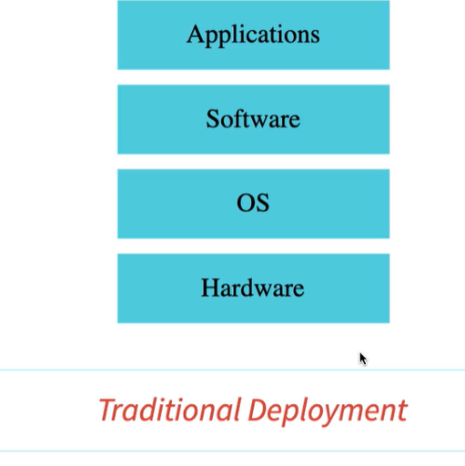

# Notes

GitHub Link: [https://github.com/in28minutes/docker-crash-course](https://github.com/in28minutes/docker-crash-course)

# (1) Introducation


## 1.1 Test application

### Docker version
```properties
C:\wokingDir\gitPro\Docker>docker --version
Docker version 19.03.5, build 633a0ea
```

### 1.2 Run application

[https://hub.docker.com/](https://hub.docker.com/) is the default docker registry.

*Image :* is a static tepmlate.(like a class)
*Container :* is running version (like object)

eg: `https://hub.docker.com/r/in28min/todo-rest-api-h2` is a repository

When we type this command,it'll download the image, it is run in our machine. this is call container.
```properties
docker run -p 5000:5000 in28min/todo-rest-api-h2:1.0.0.RELEASE
```
`-p 5000:5000` : -p {hostProt}:{containerPort}
* By default any container you run is part of something call `bridge network`

* `Ctrl+ C` to stop the application.

### 1.3 Run applcation in background.

```properties
docker run -p 5000:5000 -d in28min/todo-rest-api-h2:1.0.0.RELEASE
```
`-d` : is Detached mode. which means we don't want to tie-up it in terminal to tht life cycle of the container.
so we can run this container in the background.

### 1.4 Logs
If you need logs,
```properties
docker log <id of the container>

or

docker log <first 5 digits of the id.
```

tailing the log.
```properties
docker log -f <id of the container>
```

```properties
docker log -f <id of the container>
```
### 1.5 list container running
```properties
docker container ls
```

### creating 2 instance

```properties

```

   


